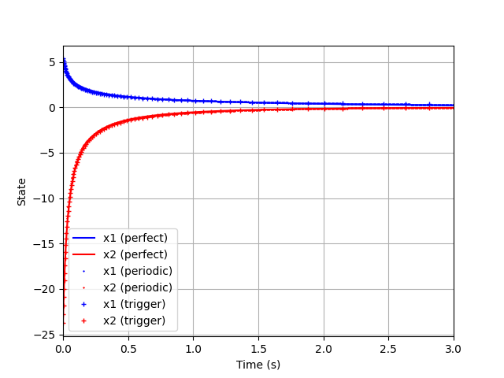
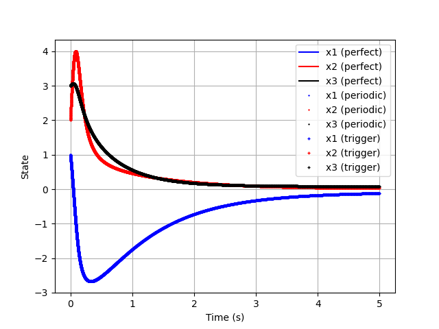

# self-triggered-control
Simulation examples from ["To sample or not to sample: Self-triggered control for nonlinear systems"](https://arxiv.org/abs/0806.0709)

This repository recreates the two main examples outlined in this paper. 

The first is the closed loop response of a homogeneous system, specifically a Jet Engine, under both periodic and self-triggered control. The second evaluates a polynomial system (a rigid body) against the same two control implementation paradigms.

### Dependencies

This code was developed and tested on Ubuntu 18.04, but should work with any Python3 distribution. In addition to Python3 we use the `numpy`, `scipy`, and `matplotlib` packages. 

These can be installed (in Ubuntu) via the following command:

```bash
pip3 install scipy numpy matplotlib
```

### Execution

To run the first example (the Jet Engine), call the following:

```bash
python3 jet_engine
```

You should see a number of plots like the following:



For the rigid body:

```bash
python3 rigid_body
```

Which will produce results similar to:


